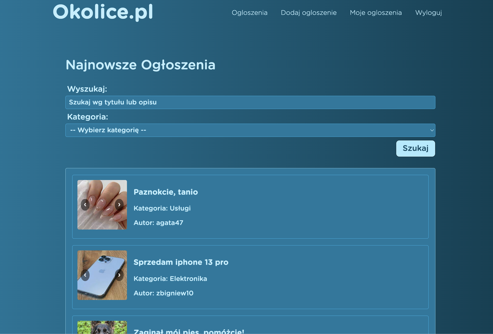
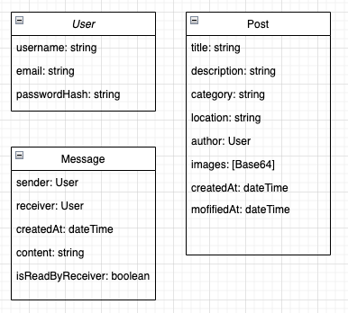
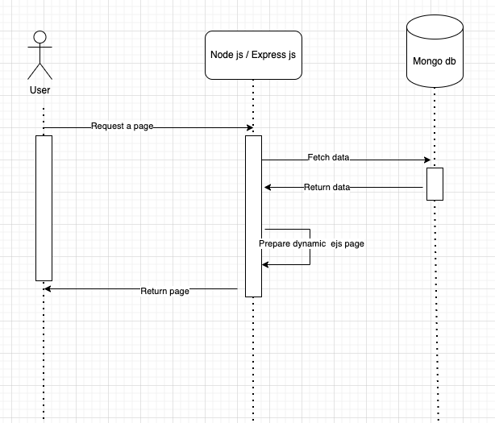

# Okolice.pl - strona internetowa z ogłoszeniami

## Załozenia projektu

* Okolice.pl to strona na której mozemy publikować wszelkiego rodzaju ogłoszenia. 
* Jeśli chcesz coś sprzedać, zaginął Ci pies, szukasz towarzystwa - Okolice.pl jest dla Ciebie!

## Stack technologiczny

* Node.js
* Express
* Mongo DB (chmura)
* Azure Web App (chmura)

## Deployment CI/CD

* Github Actions + Azure Web App
* [Okolice.pl](https://okolicepl.azurewebsites.net/)

## Główne modele

## Typowa interakcja uzytkownika z systemem

## Szybki start

### Wymagania
* Zainstalowany [Node.js](https://nodejs.org/en)
* Baza danych [MongoDB](https://www.mongodb.com/products/self-managed/community-edition)

### Instrukcja
* Pobierz lub sklonuj projekt
* Przejdź do głównego katalogu
* Dodaj plik .env zawierający:
    * `DATABASE_URL=<url-do-twojej-bazy-mongo>`
    * `SECRET=<sekretny-klucz-do-autoryzacji-jwt>`
* Uruchom `npm install`
* Uruchom `npm run devStart`
* Aplikacja będzie uruchomiona na localhost:3000